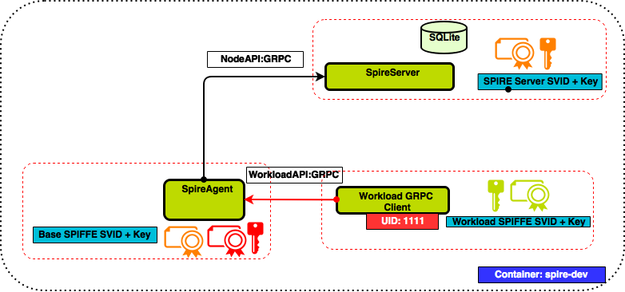

## Overview

This walkthrough will guide you through the steps needed to setup a running example of a SPIRE Server and SPIRE Agent. Interaction with the [Workload API](../proto/api/workload/workload.proto) will be simulated via a command line tool.

 
  

## Requirement(s)

### GitHub Setup

Create a directory **_spire-walkthrough_** and clone the SPIRE github repo in it.

    mkdir ~/spire-walkthrough
    cd ~/spire-walkthrough
    git clone https://github.com/spiffe/spire
        
Note: If you don’t already have a GitHub account, please get setup [here](https://github.com).

### Docker Setup

Pull the latest image from the docker repository hosted in the public repo **spiffe/spire-dev**

    docker pull spiffe/spire-dev
    
Note: If you don't already have Docker installed, please follow these [installation instructions](https://docs.docker.com/engine/installation/).

## Terminology

 |Term                   | Description                                                      |
 |-----------------------|------------------------------------------------------------------|
 |spire-server           |  SPIRE Server executable                                         |
 |spire-agent            |  SPIRE Agent executable                                          |
 |socketPath             |  Unix Domain Socket file path through which workloads            |
 |                       |  connects to Workload API                                        |                                          
 |Join Token             |  Nonce generated by the SPIRE Server to attest SPIRE Agents      |
 |selector               |  A native property of a node or workload                         |


## Walkthrough

1.  Setup your local Docker development environment, cd to the directory you cloned the SPIRE repo into and start the container.

        cd ~/spire-walkthrough/spire
        docker-compose up -d
    
2.  Check to make sure the spire-dev docker container is running. 

        docker ps |grep spire-dev

3.  Get an interactive bash prompt to the running spire-dev container.
	
        docker-compose exec spire-dev bash

4.  Create a user with uid 1000. The uid will be registered as a selector of the workload's SPIFFE ID. During kernel based attestation the workload process will be interogated for the registered uid.
	
	    useradd -u 1000 workload

5.  Install external dependencies of SPIRE by running the **vendor** target.
	
	    make vendor

6.  Build SPIRE by running the **build** target. The build target builds spire-server, spire-agent and wlcli executable, it also builds the plugin binaries.
    
        make build

7.  Try running help for register sub command. The **spire-server** and **spire-agent** executables have `-—help`  option that give details of respective cli options. 
	
	    ./cmd/spire-server/spire-server register --help

8.  View the SPIRE Server configuration file.
    	 
    	    cat conf/server/server.conf
    
    The default SPIRE Server configurations are shown below. A detailed description of each of the SPIRE Server configuration options is [here](/README.md#spire-server-configuration)
    
    ```
    BaseSVIDTTL = 999999
    ServerSVIDTTL = 999999
    BindAddress = "127.0.0.1"
    BindPort = "8081"
    BindHTTPPort = "8080"
    LogLevel = "INFO"
    PluginDir = "conf/server/plugin"
    TrustDomain = "example.org"
    Umask = ""
    ```

9.  Start the SPIRE Server as a background process by running the following command.

        ./cmd/spire-server/spire-server run &

10. Generate a one time Join Token via **spire-server token generate** sub commmand. Use the **-spiffeID** option to associate the Join Token with **spiffe://example.org/host** SPIFFE ID. Save the generated join token in your copy buffer.
	
	    ./cmd/spire-server/spire-server token generate -spiffeID spiffe://example.org/host
	    
	 The Join Token will be used for node attestation and the associated SPIFFE ID will be used to generate the SVID of the attested node. 
	 
	 The default ttl of the Join Token is 600 seconds. We can overwrite the default value through **-ttl** option.

11. View the configuration file of the SPIRE Agent
    	
        cat conf/agent/agent.conf
    
    The default SPIRE Agent configurations are shown below. A detailed description of each of the SPIRE Agent configuration options is [here](/README.md#spire-agent-configuration)
    ```
    BindAddress = "127.0.0.1"
    BindPort = "8088"
    DataDir = "."
    LogLevel = "INFO"
    PluginDir = "conf/agent/plugin"
    ServerAddress = "127.0.0.1"
    ServerPort = "8081"
    SocketPath ="/tmp/agent.sock"
    TrustBundlePath = "conf/agent/carootcert.pem"
    TrustDomain = "example.org"
    Umask = ""
    ```

12. Start the SPIRE Agent as a background process. Replace <generated-join-token> with the saved value from step #10 in the following command.

        ./cmd/spire-agent/spire-agent run -joinToken <generated-join-token> &

13. The next step is to register a SPIFFE ID with a set of selectors. For the example we will use unix kernel selectors that will be mapped to a target SPIFFE ID.
   	
        ./cmd/spire-server/spire-server register \
            -parentID spiffe://example.org/host \
            -spiffeID spiffe://example.org/host/workload \
            -selector unix:uid:1000
    At this point, the registration API has been called and the target workload has been registered with the SPIRE Server. We can now call the workload API using a command line program to request the workload SVID from the SPIRE Agent.

14. Simulate the workload API interaction and retrieve the workload SVID bundle by running the `api` subcommand in the agent. Run the command as user **_workload_** created in step #4 with uid 1000
    
        su -c "./cmd/spire-agent/spire-agent api fetch" workload

15. Examine the output. Optionally, you may write the SVID and key to disk with `-write` in order to examine them in detail.
    
        su -c "./cmd/spire-agent/spire-agent api fetch -write ./" workload
        openssl x509 -in ~/go/src/github.com/spiffe/spire/svid.0.pem -text -noout

