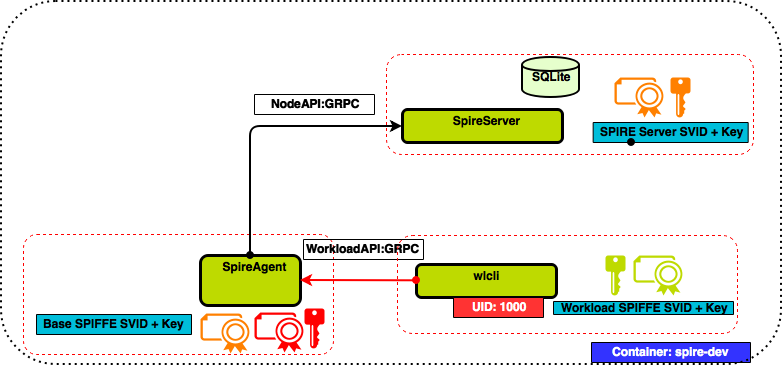

# SPIRE

## Overview

This walkthrough will guide you through the steps needed to set up a running example of a SPIRE Server and SPIRE Agent. Interaction with the [Workload API](https://github.com/spiffe/go-spiffe/blob/main/v2/proto/spiffe/workload/workload.proto) will be simulated via a command line tool.

 

## Requirement(s)

### Git Setup

Clone the SPIRE github repo.

```shell
$ git clone https://github.com/spiffe/spire
```

### Docker Setup

If you don't already have Docker installed, please follow these [installation instructions](https://docs.docker.com/engine/installation/).

## Terminology

| Term         | Description                                                                  |
|--------------|------------------------------------------------------------------------------|
| spire-server | SPIRE Server executable                                                      |
| spire-agent  | SPIRE Agent executable                                                       |
| socketPath   | Unix Domain Socket file path through which workloads connect to Workload API |
| Join Token   | Nonce generated by the SPIRE Server to attest SPIRE Agents                   |
| selector     | A native property of a node or workload                                      |

## Walkthrough

1. Build the development Docker image.

   ```shell
   $ make dev-image
   ```

2. Run a shell in the development Docker container.

   ```shell
   $ make dev-shell
   ```

3. Create a user with uid 1001. The uid will be registered as a selector of the workload's SPIFFE ID. During kernel based attestation the workload process will be interrogated for the registered uid.

   ```shell
   (in dev shell) # useradd -u 1001 workload
   ```

4. Build SPIRE by running the **build** target. The build target builds all the SPIRE binaries. This requires configuring `git` to know that the temporary docker container is safe.

   ```shell
   (in dev shell) # git config --global --add safe.directory /spire
   (in dev shell) # make build
   ```

5. Try running `help` for `entry` sub command. The **spire-server** and **spire-agent** executables have `-—help`  option that give details of respective cli options.

   ```shell
   (in dev shell) # ./bin/spire-server entry --help
   ```

6. View the SPIRE Server configuration file.

   ```shell
   $(in dev shell) # cat conf/server/server.conf
   ```

   The default SPIRE Server configurations are shown below. A detailed description of each of the SPIRE Server configuration options is in [the Server documentation](/doc/spire_server.md).

   ```hcl
   server {
       bind_address = "127.0.0.1"
       bind_port = "8081"
       trust_domain = "example.org"
       data_dir = "./.data"
       log_level = "DEBUG"
   }

   plugins {
       DataStore "sql" {
           plugin_data {
               database_type = "sqlite3"
               connection_string = "./.data/datastore.sqlite3"
           }
       }

       NodeAttestor "join_token" {
           plugin_data {
           }
       }

       KeyManager "memory" {
           plugin_data = {}
       }

       UpstreamAuthority "disk" {
           plugin_data {
               key_file_path = "./conf/server/dummy_upstream_ca.key"
               cert_file_path = "./conf/server/dummy_upstream_ca.crt"
           }
       }
   }
   ```

7. Start the SPIRE Server as a background process by running the following command.

   ```shell
   (in dev shell) # ./bin/spire-server run &
   ```

8. Generate a one time Join Token via **spire-server token generate** sub command. Use the **-spiffeID** option to associate the Join Token with **spiffe://example.org/host** SPIFFE ID. Save the generated join token in your copy buffer.

   ```shell
   (in dev shell) # ./bin/spire-server token generate -spiffeID spiffe://example.org/host
   ```

   The Join Token will be used as a form of node attestation and the associated SPIFFE ID will be assigned to the node.

   The default ttl of the Join Token is 600 seconds. We can overwrite the default value through **-ttl** option.

9. View the configuration file of the SPIRE Agent

   ```shell
   (in dev shell) # cat conf/agent/agent.conf
   ```

   The default SPIRE Agent configurations are shown below. A detailed description of each of the SPIRE Agent configuration options is in [the Agent documentation](/doc/spire_agent.md).

   ```hcl
   agent {
       data_dir = "./.data"
       log_level = "DEBUG"
       server_address = "127.0.0.1"
       server_port = "8081"
       socket_path ="/tmp/spire-agent/public/api.sock"
       trust_bundle_path = "./conf/agent/dummy_root_ca.crt"
       trust_domain = "example.org"
   }
   
   plugins {
       NodeAttestor "join_token" {
           plugin_data {
           }
       }
       KeyManager "disk" {
           plugin_data {
               directory = "./.data"
           }
       }
       WorkloadAttestor "unix" {
           plugin_data {
           }
       }
   }
   ```

10. Start the SPIRE Agent as a background process. Replace `<generated-join-token>` with the saved value from step #8 in the following command.

    ```shell
    (in dev shell) # ./bin/spire-agent run -joinToken <generated-join-token> &
    ```

11. The next step is to register a SPIFFE ID with a set of selectors. For the example we will use unix kernel selectors that will be mapped to a target SPIFFE ID.

    ```shell
    (in dev shell) # ./bin/spire-server entry create \
        -parentID spiffe://example.org/host \
        -spiffeID spiffe://example.org/workload \
        -selector unix:uid:1001
    ```

    At this point, the target workload has been registered with the SPIRE Server. We can now call the Workload API using a command line program to request the workload SVID from the SPIRE Agent.

12. Simulate the Workload API interaction and retrieve the workload SVID bundle by running the `api` subcommand in the agent. Run the command as user **_workload_** created in step #3 with uid 1001

    ```shell
    (in dev shell) # su -c "./bin/spire-agent api fetch x509 " workload
    ```

13. Examine the output. Optionally, you may write the SVID and key to disk with `-write` in order to examine them in detail.

    ```shell
    (in dev shell) # su -c "./bin/spire-agent api fetch x509 -write /tmp" workload
    (in dev shell) # openssl x509 -in /tmp/svid.0.pem -text -noout
    ```
