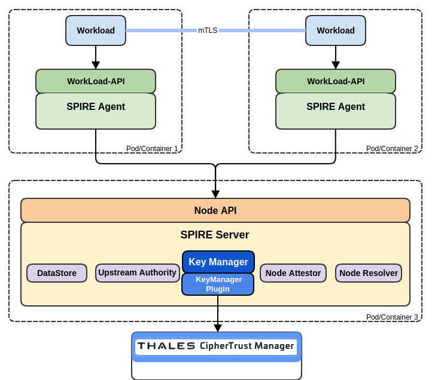

# Server Plugin: "Thales CipherTrust KMS"

The ```ciphertrust_kms``` plugin leverages the Thales CipherTrust Key Management Service to create, maintain and rotate key pairs, signing SVIDs as needed. Thales CipherTrust KMS access the key material on behalf of of SPIRE only.


## Prerequisite
The plugin needs to store the spire key metadata which is the server-id in the ctmkms folder.

```
mkdir spire/ctmkms
```
## Architecture



## Configuration

The plugin accepts the following configuration options:
| Key | Type | Required | Description
| --- | ---- | -------- | -----------|
|key_metadata_file | string | yes | A file path location where key metadata used by the plugin will be persisted |
|ctm_url| string | yes | A valid CipherTrust Manager instance |
|username| string | yes | Username to access the KMS |
|password| string | yes | Password to access the KMS |

## Sample Plugin Configuration

```
plugins {
        KeyManager "ciphertrust_kms" {
        plugin_data = {
         key_metadata_file = "ctmkms/ctmkms-key-metadata"
         ctm_url = "https://your-ctm-instance"
         username = "username"
         password = "P@ssword"
        }
    }
}
```

## Supported Key Type
The plugin supports only the key type: ec-p256

Signature algorithm: ECDSA SHA256


## Authenticating with the CipherTrust KMS API
The plugin uses the username and password in exchange of a JWT token.

## Use of a key versions
In CipherTrust KMS, the cryptographic key material that is uses to sign data is stored in a CipherTrustCryptoKey.
The CipherTrustCryptoKey contains the version as well.

For each SPIRE Key ID that the server manages, this plugin maintains a CipherTrustCryptoKey. When a key is rotated, a new CipherTrustCryptoKey is created.

## Management of keys
The plugin assigns labels to the CipherTrustCryptoKey that it manages in order to keep track of them. The use of these labels also allows efficient filtering when performing the listing operations in the service. All the labels are named with the spire- prefix. Users don't need to interact with the labels managed by the plugin. The following table is provided for informational purposes only:

| Label | Description |
| ----- | ----------- |
| spire-server-td | SHA-1 checksum of the trust domain name of the server. |
| spire-server-id | Auto-generated ID that is unique to the server and is persisted in the _Key Metadata File_ (see the `key_metadata_file` configurable). |
| spire-last-update | Unix time of the last time that the plugin updated the CryptoKey to keep it active. |
| spire-active | Indicates if the CipherTrustCryptoKey is still in use by the plugin. |

If the Key Metadata File is not found during server startup, the file is recreated, with a new auto-generated server ID. Consequently, if the file is lost, the plugin will not be able to identify keys that it has previously managed and will recreate new keys on demand.

*Note:* The plugin is still under development and do not schedule keys for destruction.

## Getting Started
https://spiffe.io/docs/latest/try/getting-started-linux-macos-x/

### Build
Let's build the SPIRE Server and agent.

The agent here is built for demo purposes and has not being modified.

```
make bin/spire-server
make bin/spire-agent
```

### Run
1. Setup the Server

```
bin/spire-server run -config conf/server/server.conf
```

```
INFO[0000] Plugin loaded                                 external=false plugin_name=join_token plugin_type=NodeAttestor subsystem_name=catalog
DEBU[0000] Loaded server ID                              external=false plugin_name=ciphertrust_kms plugin_type=KeyManager server_id=f2554a90-8ce7-4d73-9788-cf842e31c4ef subsystem_name=catalog
DEBU[0000] Fetching keys from Cloud KMS                  external=false plugin_name=ciphertrust_kms plugin_type=KeyManager subsystem_name=catalog
```

```
DEBU[0000] Preparing X509 CA                             slot=A subsystem_name=ca_manager
deactivation date=2023-10-19T13:53:40.400656705-04:00
DEBU[0000] CryptoKey created                             algorithm=EC_SIGN_P256_SHA256 crypto_key_name=spire-key-f2554a90-8ce7-4d73-9788-cf842e31c4ef-x509-CA-A external=false plugin_name=ciphertrust_kms plugin_type=KeyManager subsystem_name=catalog
DEBU[0000] CryptoKeyVersion version added                crypto_key_name=spire-key-f2554a90-8ce7-4d73-9788-cf842e31c4ef-x509-CA-A crypto_key_version_name=spire-key-f2554a90-8ce7-4d73-9788-cf842e31c4ef-x509-CA-A/cryptoKeyVersions/0 external=false plugin_name=ciphertrust_kms plugin_type=KeyManager subsystem_name=catalog
```

```
DEBU[0000] Public Key Created by CipherTrust             -----BEGIN PUBLIC KEY-----
MFkwEwYHKoZIzj0CAQYIKoZIzj0DAQcDQgAEmx69X4ulBJ3+a6OHkM5vXWaO82WI
D5k6Y2xCFoC5gbOF/LuboXAtiqA7WFow2XWwODYKt0kfB2PCdsCEVueoGw==
-----END PUBLIC KEY-----
```

```
crypto_key_name=spire-key-f2554a90-8ce7-4d73-9788-cf842e31c4ef-x509-CA-A external=false plugin_name=ciphertrust_kms plugin_type=KeyManager subsystem_name=catalog
-> Sending hash to be signed by CipherTrust
 c9ea8add26f39aa158f3fff3c158349ced3ae0cb85442bfbe8c58ca32591f404

DEBU[0001] <- Signature received from CipherTrust        external=false plugin_name=ciphertrust_kms plugin_type=KeyManager subsystem_name=catalog
DEBU[0001] 3045022100ef8a4b38c1aea5013011e43b29f2a48638fda5cdf8b88915172124ab4637020c02200726614a2f2e460ae9fe7b722fb38bae8ee373a40e746b9c96b0b90746e614cb  external=false plugin_name=ciphertrust_kms plugin_type=KeyManager subsystem_name=catalog
-> Sending hash to be signed by CipherTrust
 0fb08dae8482188af1199c51a02fae3245078f48ff0da78c576bf0bc4490a58e

DEBU[0001] <- Signature received from CipherTrust        external=false plugin_name=ciphertrust_kms plugin_type=KeyManager subsystem_name=catalog
DEBU[0001] 304502202105f3837f7c8cd5b837bb85a3c5b6b45622ff4bc317e3fd4e3d5417b7fd0d410221008a45c242e28c1ad47e0e6f0cda534783e05d94a88d2c27290bff25b1fbb57591  external=false plugin_name=ciphertrust_kms plugin_type=KeyManager subsystem_name=catalog
INFO[0001] X509 CA prepared  
```

```
8651a000 self_signed=false slot=A subsystem_name=ca_manager
INFO[0001] X509 CA activated                             expiration="2023-10-19 13:53:31 -0400 EDT" issued_at="2023-10-18 13:53:30.400495873 -0400 EDT" local_authority_id=0cf195df2364771dd411f0929f6a54dd8651a000 slot=A subsystem_name=ca_manager
DEBU[0001] Successfully rotated X.509 CA                 subsystem_name=ca_manager trust_domain_id="spiffe://example.org" ttl=86399.219490121
```

```
DEBU[0001] Preparing JWT key                             slot=A subsystem_name=ca_manager
deactivation date=2023-10-19T13:53:41.780769086-04:00
DEBU[0002] CryptoKey created                             algorithm=EC_SIGN_P256_SHA256 crypto_key_name=spire-key-f2554a90-8ce7-4d73-9788-cf842e31c4ef-JWT-Signer-A external=false plugin_name=ciphertrust_kms plugin_type=KeyManager subsystem_name=catalog
DEBU[0002] CryptoKeyVersion version added                crypto_key_name=spire-key-f2554a90-8ce7-4d73-9788-cf842e31c4ef-JWT-Signer-A crypto_key_version_name=spire-key-f2554a90-8ce7-4d73-9788-cf842e31c4ef-JWT-Signer-A/cryptoKeyVersions/0 external=false plugin_name=ciphertrust_kms plugin_type=KeyManager subsystem_name=catalog
DEBU[0002] Public Key Created by CipherTrust             -----BEGIN PUBLIC KEY-----
MFkwEwYHKoZIzj0CAQYIKoZIzj0DAQcDQgAE/3XVqNqiiobR+dxozHEJhqQtoh+B
FUm2MWZGqWAVLO6nm8jB2Li2fzy5i6tgiTu+ZTCH9Od4xF+a/lNrxscQEw==
-----END PUBLIC KEY-----
="<unknown>" crypto_key_name=spire-key-f2554a90-8ce7-4d73-9788-cf842e31c4ef-JWT-Signer-A external=false plugin_name=ciphertrust_kms plugin_type=KeyManager subsystem_name=catalog
WARN[0002] UpstreamAuthority plugin does not support JWT-SVIDs. Workloads managed by this server may have trouble communicating with workloads outside this cluster when using JWT-SVIDs.  plugin_name=disk subsystem_name=ca_manager
INFO[0002] JWT key prepared                              expiration="2023-10-19 13:53:31.780614826 -0400 EDT" issued_at="2023-10-18 13:53:31.780614826 -0400 EDT" local_authority_id=9FQAbFplzD4ezP3HZhaobcwYJX8Bj13q slot=A subsystem_name=ca_manager
INFO[0002] JWT key activated                             expiration="2023-10-19 13:53:31.780614826 -0400 EDT" issued_at="2023-10-18 13:53:31.780614826 -0400 EDT" local_authority_id=9FQAbFplzD4ezP3HZhaobcwYJX8Bj13q slot=A subsystem_name=ca_manager
DEBU[0002] Rotating server SVID                          subsystem_name=svid_rotator
-> Sending hash to be signed by CipherTrust
 f8ec9cf941baa380d022932b76feb4ba020b57881850065b742c5d1dbf4b3520

DEBU[0002] <- Signature received from CipherTrust        external=false plugin_name=ciphertrust_kms plugin_type=KeyManager subsystem_name=catalog
DEBU[0002] 3045022100a5a84957b08180826aaa87a07e0f65ff16ede5ade80766604daa7c077331717c0220370fc3c36fb01c5404b8900a4fa62fa06a67319671ac2e5d0adaa8e92baf260f  external=false plugin_name=ciphertrust_kms plugin_type=KeyManager subsystem_name=catalog
DEBU[0002] Signed X509 SVID                              expiration="2023-10-18T18:53:32Z" spiffe_id="spiffe://example.org/spire/server" subsystem_name=svid_rotator
```

2. Register an agent

```
bin/spire-server token generate -spiffeID spiffe://example.org/mydemoagent

Token: 43d621b7-fdc4-481a-b43f-59617d51d225
```

```
bin/spire-agent run -config conf/agent/agent.conf -joinToken 43d621b7-fdc4-481a-b43f-59617d51d225
```

```
bin/spire-server entry create -parentID spiffe://example.org/mydemoagent -spiffeID spiffe://example.org/mydemoservice -selector unix:uid:$(id -u)


Entry ID         : b7bfaea0-a3cd-4d90-8677-6650dea1d43a
SPIFFE ID        : spiffe://example.org/mydemoservice
Parent ID        : spiffe://example.org/mydemoagent
Revision         : 0
X509-SVID TTL    : default
JWT-SVID TTL     : default
Selector         : unix:uid:1000
```

3. Agent requests its SVID
```
bin/spire-agent api fetch x509 -write /tmp/
```

4. Read the Agent's SVID
```
openssl x509 -in /tmp/svid.0.pem -text -noout

Certificate:
    Data:
        Version: 3 (0x2)
        Serial Number:
            2e:f0:d4:43:b2:4d:c3:a9:cd:58:6b:b9:93:af:65:65
        Signature Algorithm: ecdsa-with-SHA256
        Issuer: C = US, O = SPIFFE
        Validity
            Not Before: Oct 18 18:06:58 2023 GMT
            Not After : Oct 18 19:07:08 2023 GMT
        Subject: C = US, O = SPIRE, x500UniqueIdentifier = 83b61c3be6a325b09c07a73253e10a77
        Subject Public Key Info:
            Public Key Algorithm: id-ecPublicKey
                Public-Key: (256 bit)
                pub:
                    04:d0:26:89:6b:b2:85:4e:32:c9:41:91:23:20:a9:
                    e8:25:07:6b:36:da:75:2b:5d:b4:2e:bf:4c:32:f4:
                    d6:cf:b6:a7:12:23:c8:1a:f7:de:fd:ed:be:fa:cd:
                    0a:3a:e2:63:fe:21:f1:5e:07:1b:96:e1:80:9c:84:
                    e3:c4:86:96:87
                ASN1 OID: prime256v1
                NIST CURVE: P-256
        X509v3 extensions:
            X509v3 Key Usage: critical
                Digital Signature, Key Encipherment, Key Agreement
            X509v3 Extended Key Usage: 
                TLS Web Server Authentication, TLS Web Client Authentication
            X509v3 Basic Constraints: critical
                CA:FALSE
            X509v3 Subject Key Identifier: 
                96:15:70:F4:41:85:EF:7C:E4:08:7A:2D:41:C8:8B:17:F9:B0:63:28
            X509v3 Authority Key Identifier: 
                keyid:0C:F1:95:DF:23:64:77:1D:D4:11:F0:92:9F:6A:54:DD:86:51:A0:00

            X509v3 Subject Alternative Name: 
                URI:spiffe://example.org/mydemoservice
    Signature Algorithm: ecdsa-with-SHA256
         30:45:02:21:00:94:2d:ed:16:d8:21:b6:6b:d6:62:2b:10:ce:
         d4:40:fe:b3:c6:3c:ec:c1:94:21:36:67:0d:6d:5c:e7:63:c1:
         ba:02:20:4c:f6:81:72:d9:2c:62:01:72:7e:6e:04:9f:66:d2:
         96:7d:49:1b:fd:d5:5a:e8:40:05:ff:67:bc:5f:0f:34:ef
```


Additionally, check the servers entry
```
bin/spire-server entry show


Found 2 entries
Entry ID         : 7faf0c81-d25c-4d9f-9da5-3f7f142e6d95
SPIFFE ID        : spiffe://example.org/mydemoagent
Parent ID        : spiffe://example.org/spire/agent/join_token/43d621b7-fdc4-481a-b43f-59617d51d225
Revision         : 0
X509-SVID TTL    : default
JWT-SVID TTL     : default
Selector         : spiffe_id:spiffe://example.org/spire/agent/join_token/43d621b7-fdc4-481a-b43f-59617d51d225

Entry ID         : b7bfaea0-a3cd-4d90-8677-6650dea1d43a
SPIFFE ID        : spiffe://example.org/mydemoservice
Parent ID        : spiffe://example.org/mydemoagent
Revision         : 0
X509-SVID TTL    : default
JWT-SVID TTL     : default
Selector         : unix:uid:1000

```


