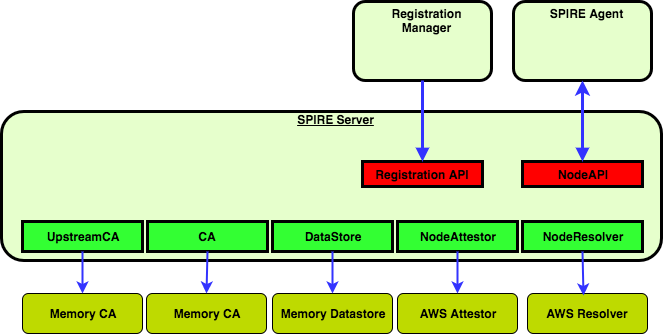

# SPIRE Server

SPIRE Server is responsible for validating and signing all CSRs in the SPIFFE trust domain.
Validation is performed through platform-specific Attestation plugins, as well as policy enforcement
backed by the SPIRE Server datastore.

## Server configuration file

The following details the configurations for the spire server. The configurations can be set through
a .conf file or passed as command line args, the command line configurations takes precedence.

| Configuration               | Description                                            | Default                       |
|:----------------------------|:-------------------------------------------------------|:------------------------------|
| `base_svid_ttl`             | TTL to use when creating the base SPIFFE ID            |                               |
| `bind_address`              | IP address or DNS name of the SPIRE server             |                               |
| `bind_port`                 | HTTP Port number of the SPIRE server                   |                               |
| `registration_uds_path`     | Location to bind the registration API socket           | $PWD/spire_api                |
| `log_file`                  | File to write logs to                                  |                               |
| `log_level`                 | Sets the logging level \<DEBUG\|INFO\|WARN\|ERROR\>    | INFO                          |
| `trust_domain`              | The trust domain that this server belongs to           |                               |
| `umask`                     | Umask value to use for new files                       | 0077                          |
| `upstream_bundle`           | Include upstream CA certificates in the trust bundle   | false                         |

**Note:** Changing the umask may expose your signing authority to users other than the SPIRE
agent/server.

## Plugin configuration

The server configuration file also contains the configuration for the server plugins.
Plugin configurations are under the `plugins { ... }` section, which has the following format:

```hcl
plugins {
    pluginType "pluginName" {
        ...
        plugin configuration options here
        ...
    }
}
```

The following configuration options are available to configure a plugin:

| Configuration   | Description                              |
| --------------- | ---------------------------------------- |
| plugin_cmd      | Path to the plugin implementation binary (optional, not needed for built-ins) |
| plugin_checksum | An optional sha256 of the plugin binary  (optional, not needed for built-ins) |
| enabled         | Enable or disable the plugin (enabled by default)             |
| plugin_data     | Plugin-specific data                     |

Please see the [built-in plugins](#built-in-plugins) section below for information on plugins that are available out-of-the-box.

## Command line options

### `spire-server run`

All of the configuration file above options have identical command-line counterparts. In addition, the following flags are available.

| Command          | Action                      | Default                 |
|:-----------------|:----------------------------|:------------------------|
| `-config string` | Path to a SPIRE config file | conf/server/server.conf |

### `spire-server token generate`

Generates one node join token and creates a registration entry for it. This token can be used to
bootstrap one spire-agent installation. The optional `-spiffeID` can be used to give the tooken a
human-readable registration entry name in addition to the token-based entry.

| Command       | Action                                                    | Default        |
|:--------------|:----------------------------------------------------------|:---------------|
| `-serverAddr` | Address of the SPIRE server to register with              | localhost:8081 |
| `-spiffeID`   | Additional SPIFFE ID to assign the token owner (optional) |                |
| `-ttl`        | Token TTL in seconds                                      | 600            |

### `spire-server entry create`

Creates registration entries.

| Command          | Action                                                                 | Default        |
|:-----------------|:-----------------------------------------------------------------------|:---------------|
| `-data`          | Path to a file containing registration data in JSON format (optional). |                |
| `-parentID`      | The SPIFFE ID of this record's parent.                                 |                |
| `-selector`      | A colon-delimeted type:value selector used for attestation. This parameter can be used more than once, to specify multiple selectors that must be satisfied. | |
| `-serverAddr`    | Address of the SPIRE server.                                           | localhost:8081 |
| `-spiffeID`      | The SPIFFE ID that this record represents and will be set to the SVID issued. | |
| `-ttl`           | A TTL, in seconds, for any SVID issued as a result of this record.     | 3600           |
| `-federatesWith` | A list of trust domain SPIFFE IDs representing the trust domains this registration entry federates with. A bundle for that trust domain must already exist | |

### `spire-server entry delete`

Deletes a specified registration entry.

| Command       | Action                                             | Default        |
|:--------------|:---------------------------------------------------|:---------------|
| `-entryID`    | The Registration Entry ID of the record to delete  |                |
| `-serverAddr` | Address of the SPIRE server                        | localhost:8081 |

### `spire-server entry show`

Displays configured registration entries.

| Command       | Action                                                             | Default        |
|:--------------|:-------------------------------------------------------------------|:---------------|
| `-entryID`    | The Entry ID of the record to show.                                |                |
| `-parentID`   | The Parent ID of the records to show.                              |                |
| `-selector`   | A colon-delimeted type:value selector. Can be used more than once to specify multiple selectors. | |
| `-serverAddr` | Address of the SPIRE server.                                       | localhost:8081 |
| `-spiffeID`   | The SPIFFE ID of the records to show.                              |                |
| `-selector`   | A TTL, in seconds, for any SVID issued as a result of this record. | 3600           |

### `spire-server bundle show`

Displays the bundle for the trust domain of the server.

| Command       | 
|:--------------|:-------------------------------------------------------------------|:---------------|
| `-serverAddr` | Address of the SPIRE server.                                       | localhost:8081 |

### `spire-server bundle list`

Displays bundles from other trust domains.

| Command       | Action                                                             | Default        |
|:--------------|:-------------------------------------------------------------------|:---------------|
| `-id`         | The trust domain SPIFFE ID of the bundle to show. If unset, all trust bundles are shown | |

### `spire-server bundle set`

Creates or updates bundle data for a trust domain. This command cannot be used to alter the server trust domain bundle, only bundles for other trust domains.

| Command       | Action                                                             | Default        |
|:--------------|:-------------------------------------------------------------------|:---------------|
| `-id`         | The trust domain SPIFFE ID of the bundle to set. | |
| `-path`       | Path on disk to the file containing the bundle data. If unset, data is read from stdin. | |

### `spire-server bundle delete`

Deletes bundle data for a trust domain. This command cannot be used to delete the server trust domain bundle, only bundles for other trust domains.

| Command       | Action                                                             | Default        |
|:--------------|:-------------------------------------------------------------------|:---------------|
| `-id`         | The trust domain SPIFFE ID of the bundle to delete. | |
| `-mode`       | One of: `restrict`, `dissociate`, `delete`. `restrict` prevents the bundle from being deleted if it is associated to registration entries (i.e. federated with). `dissociate` allows the bundle to be deleted and removes the association from registration entries. `delete` deletes the bundle as well as associated registration entries. | `restrict` |

## Architecture

The server consists of a master process (spire-server) and five plugins - the CA, the Upstream CA,
The Data Store, the Node Attestor, and the Node Resolver. The master process implements the Registration
API and the Node API, with which agents communicate with the server.



## Plugin types

| Type           | Description |
|:---------------|:------------|
| ServerCA       | Implements both signing and key storage logic for the server's CA operations. Useful for leveraging hardware-based key operations. |
| DataStore      | Provides persistent storage and HA features. |
| NodeAttestor   | Implements validation logic for nodes attempting to assert their identity. Generally paired with an agent plugin of the same type. |
| NodeResolver   | A plugin capable of discovering platform-specific metadata of nodes which have been successfully attested. Discovered metadata is stored as selectors and can be used when creating registration entries. |
| UpstreamCA     | Allows SPIRE server to integrate with existing PKI systems. The ServerCA plugin generates CSRs for its signing authority, which are submitted to the upstream CA for signing. |

## Built-in plugins

| Type | Name | Description |
| ---- | ---- | ----------- |
| ServerCA  | [memory](/doc/plugin_server_ca_memory.md) | An in-memory CA for signing SVIDs |
| DataStore | [sql](/doc/plugin_server_datastore_sql.md) | An sql database storage for SQLite and PostgreSQL databases for the SPIRE datastore |
| NodeAttestor | [join_token](/doc/plugin_server_nodeattestor_jointoken.md) | A node attestor which validates agents attesting with server-generated join tokens |
| NodeAttestor | [aws_iid](/doc/plugin_server_nodeattestor_aws_iid.md) | A node attestor which validates agents attesting with AWS Instance Identity Document and Signatures. |
| NodeResolver | [noop](/doc/plugin_server_noderesolver_noop.md) | It is mandatory to have at least one node resolver plugin configured. This one is a no-op |
| UpstreamCA | [disk](/doc/plugin_server_upstreamca_disk.md) | Uses a CA loaded from disk to generate SPIRE server intermediate certificates for use in the ServerCA plugin |

## Further reading

* [SPIFFE Reference Implementation Architecture](https://docs.google.com/document/d/1nV8ZbYEATycdFhgjTB619pwIvamzOjU6l0SyBGbzbo4/edit#)
* [Design Document: SPIFFE Reference Implementation (SRI)](https://docs.google.com/document/d/1RZnBfj8I5xs8Yi_BPEKBRp0K3UnIJYTDg_31rfTt4j8/edit#)
