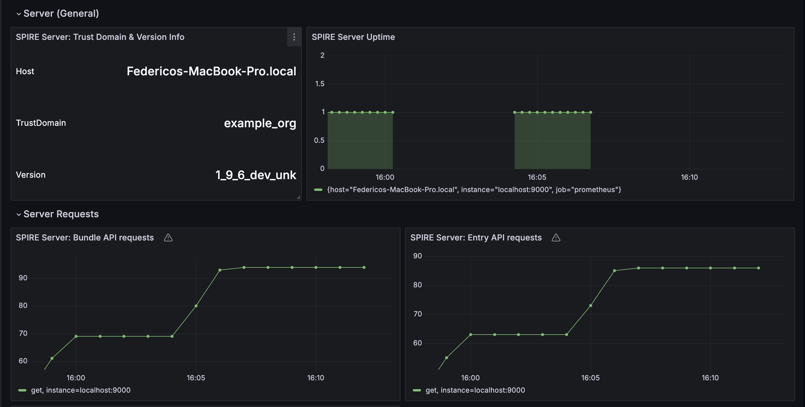
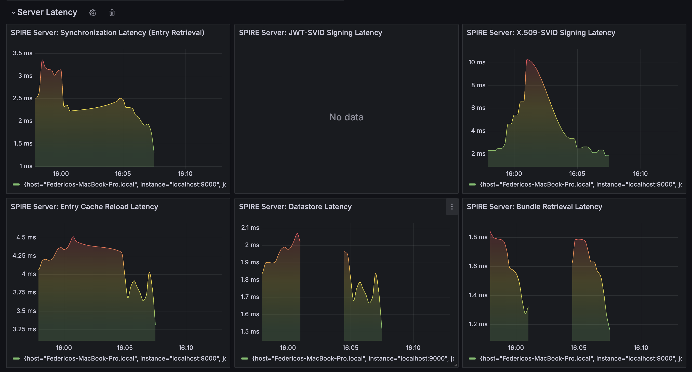

# Grafana Dashboard

## Overview

This walkthrough will guide you through the different dashboards available in Grafana after setting it up with Prometheus metrics generated by SPIRE Server and Agent. For more information about configuring and generating metrics, refer to the [Telemetry Configuration](telemetry_config.md).

The steps to get started include:

1. **Connecting Grafana to Prometheus:** Ensure Grafana is configured to use Prometheus as a data source (DataSource name: uid_prometheus_grafana_datasource)
2. **Loading the Dashboard JSON:** Import the provided JSON file into Grafana to set up the dashboards.
3. **Understanding the Metrics:** Familiarize yourself with the metrics provided by SPIRE Server and Agent to effectively use the dashboards.

## Dashboards Overview

This JSON configuration for Grafana offers a comprehensive set of dashboards that help in monitoring and analyzing the performance, health, and activities of the SPIRE Server and Agent. The key dashboards are divided into two main sections: Agent and Server.

### Agent Dashboards

#### 1. Agent (General)

This dashboard provides an overview of the agents, including:

- **Number of Agents:** Displays the total number of agents categorized by trust domain and version.

#### 2. Agent

This dashboard offers detailed information about individual agents, including:

- **Request Metrics:** Shows the number of requests each agent has made.
- **Request Status:** Displays the status of each request made by the agents.

#### 3. Agent Latency

This dashboard focuses on the latency of various operations, such as:

- **Retrieval Operations:** Measures the time taken to retrieve data.
- **Sync Operations:** Tracks the latency involved in synchronization processes.

#### 4. Agent Runtime Info

This dashboard provides runtime information about the agents, including:

- **Alloc Bytes:** Shows the amount of memory allocated by the agents.
- **Heap Objects:** Displays the number of heap objects in use.

### Server Dashboards

#### 1. Server (General)

This dashboard provides an overview of the server, including:

- **Trust Domain & Version:** Displays the server trust domain and version.
- **Uptime:** Shows the duration the server has been up.

#### 2. Server Requests

This dashboard focuses on the API requests received for the following entities:

- **Agent**
- **Entry**
- **Bundle**

#### 3. Server Latency

This dashboard focuses on the latency of various operations, such as:

- **Retrieval:** Measures the time taken to retrieve data.
- **Signing:** Tracks the latency involved in signing processes.
- **Cache Reload:** Monitors the time taken for cache reload operations.
- **Datastore:** Measures the latency of datastore interactions.

#### 4. Server Runtime Info

This dashboard provides runtime information about the server, including:

- **Alloc Bytes:** Shows the amount of memory allocated by the server.
- **Heap Objects:** Displays the number of heap objects in use.

## Filters

To refine the data displayed on the dashboards, several filters are available:

- **Agent Filter:** Select a specific agent to view detailed information about it.
- **Server Filter:** Select a specific server to view detailed information about it.
- **Time Filter:** Choose the time period for which you want to view the data.

## Steps to Import a JSON Dashboard

1. **Open Grafana:** Log in to your Grafana instance.
2. **Configure Data Source:** Ensure that a Prometheus data source is configured with the Prometheus server that is monitoring SPIRE. You can search for "Data sources" in the search bar to go to the configuration of data sources. Please refer to the [Prometheus telemetry configuration documentation](telemetry_config.md#prometheus) for details about how to configure Prometheus as a metrics collector in SPIRE.
3. **Import Dashboard:** Click on the "+" icon in the sidebar and select "Import dashboard".
4. **Upload JSON File:** Use the upload option to import the provided JSON file, or replace into "Import via dashboard JSON model".

By following these steps, you can set up and explore the Grafana dashboards to monitor and analyze the metrics generated by SPIRE Server and Agent, enabling effective performance and health management of your systems.

## Example images

