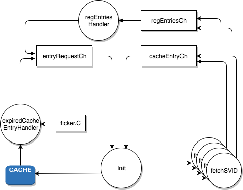

Spire Agent maintains an in-memory cache. The workload API does lookup on this cache to serve attested workload with their respective SVIDs and bundles.

A Cache Entry consists of:
* Registration Entry
* SVID
* Private Key
* federated bundles
* Expiry time

Cache manager serves the purpose of keeping the spire agents' cache updated. It monitors the cache for expiring cache entries and replaces them with new SVID and Private Key.
The cache manager also periodically looks for new registration entries and updates the cache with respective new cache entries.  

The agent bootstrap logic initiates the cache manager. The `Init` function kicks off `expiredCacheEntryHandler` and `regEntryHandler` go routines and services the corresponding requests received from them on the `entryRequestCh` channel. 
For each of the received requests, the main loop in the init goroutine fans-out fetchSVID go routines. The fetchSVID go routines call the `FetchSVID` node API endpoint and fans into `cacheEntryCh` and `regEntriesCh` channels, the respective components of the `FetchSVIDResponse` response.
Entries received on the `cacheEntryCh` are updated in the cache.   

A timer is set in the `expiredCacheEntryHandler` goroutine which triggers lookup of expired cached entries. The timer also sets off a call to the `fetchWithEmptyCSR` method that calls the FetchSVID endpoint with an empty CSR request to look for new registration entries out of band when none of the entries in the cache have expired.  
