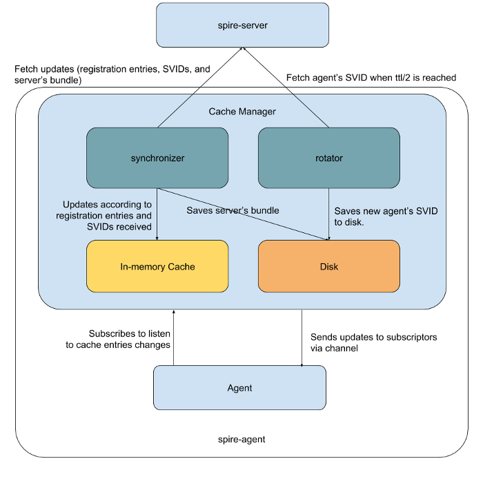
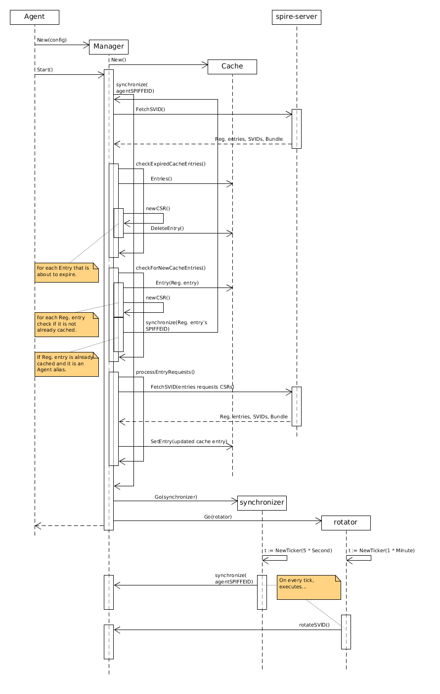

Spire Agent maintains an in-memory cache. The workload API does lookup on this cache to serve attested workload with their respective SVIDs and bundles.

A Cache Entry consists of:
* Registration Entry
* SVID
* Private Key
* Federated Bundles

Cache manager serves the purpose of keeping the spire agents' cache updated. It has the following responsabilities:
- Fetch updates from spire server (registration entries, SVIDs, and latest server bundle).
- Monitor the cache for expiring cache entries and replaces them with new SVID and Private Key.
- Look for new registration entries and update the cache with new cache entries.
- Be aware of server bundle rotation and caching it accordingly.
- Rotate agent's SVID.

The agent bootstrap logic creates and initiates the cache manager. The `Start` function runs the 
first synchronization and then kicks off `synchronizer` and `rotator` tracked go routines. These go routines create a `time.Ticker` with some specified period and then wait for ticks to call 
`synchronize` and `rotateSVID` methods respectively.  

The following diagram summarizes what happens on Cache Manager startup, focusing on `synchronize` method logic:

`synchronize` method receives a SPIFFEID as a parameter, which could be the agent's SPIFFEID or any of its aliases. This parameter is used to determine which connection should be used to fetch updates from the server, because when creating the connection an SVID should be specified, hence the agent should keep a separate connection per SPIFFEID it is entitled to use.

When `synchronize` is called, the first thing it does is calling `FetchSVID` (passing an empty list of CSRs) on the spire-server's NodeAPI using the corresponding connection based on the SPIFFEID received as a parameter, then the  server responds with the registration entries for it, no SVIDs (because we didn't send any CSR at this point), and the latest server bundle.  
Once the Manager receives this data, if first stores the server bundle on Disk (this is not shown on the diagram to keep it simpler) and keeps the registration entries in `regEntries` variable.  
The second step is to `checkExpiredCacheEntries`, here the manager gets the current `cache.Entries()` and iterate over them looking for entries that are about to expire. When the expiration condition is met, a new cache entry request is created containing a new CSR and the expired cache entry is deleted using `cache.DeleteEntry()` method. These new cache entry requests are accumulated on a `entryRequests` map keyed by registration entry's parent SPIFFEID, which is returned for later use.  
Next, the `synchronize` method loops while there are still `regEntries` or `entryRequests` to process, and executes on each iteration the following:
1) `entryRequests := checkForNewCacheEntries(regEntries, entryRequests)`  
Iterates over the `regEntries` received, if the `regEntry` is not already cached and there is not a cache entry requests already created for it, then creates a new cache entry requests and adds it to `entryRequests`. If the `regEntry` is already cached and it is an Agent's alias, a recursive call to `synchronize(regEntry.SpiffeId)` is made. Finally this function returnst the `entryRequests` parameter.
1) `regEntries := processEntryRequests(entryRequests)` 
Iterates over the `entryRequests` received, and for each element (which is an `entryRequestsList`) it calls to `FetchSVID` NodeAPI method with the list of CSRs taken from `entryRequestsList`. Then the Manager receives registration entries, SVIDs, and the latest server bundle. It uses the SVIDs to update the cache entries and collects the registration entries to return them at finalization.
