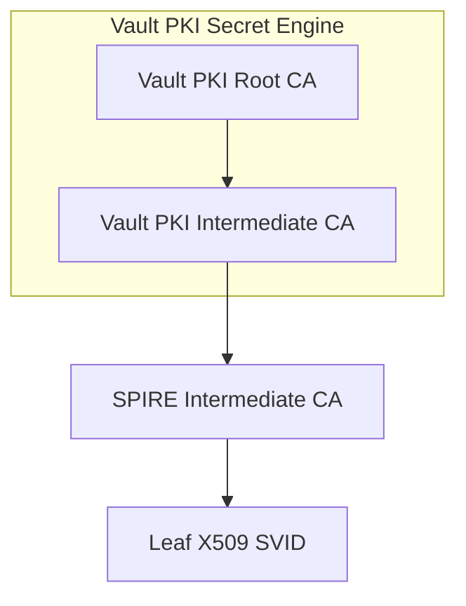

# UpstreamAuthority vault plugin suite

## Description

This suite sets up a Kubernetes cluster using [Kind](https://kind.sigs.k8s.io),
installs HashiCorp Vault. It then asserts the following:

PKI tree

* SPIRE server successfully requests an intermediate CA from the referenced Vault PKI Secret Engine
* Verifies that Auth Methods are configured successfully
* Verifies that obtained identities have been signed by that intermediate CA, and the Vault PKI Secret Engine is the root of trust
